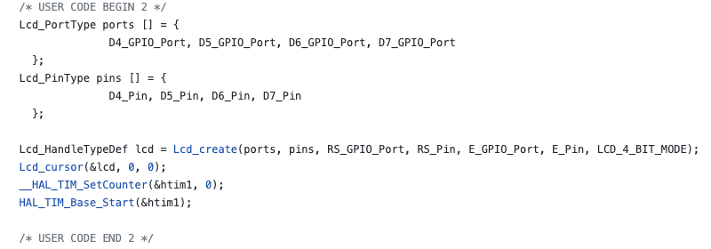
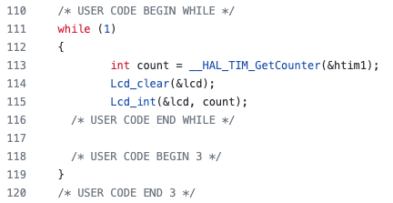
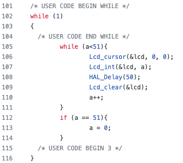
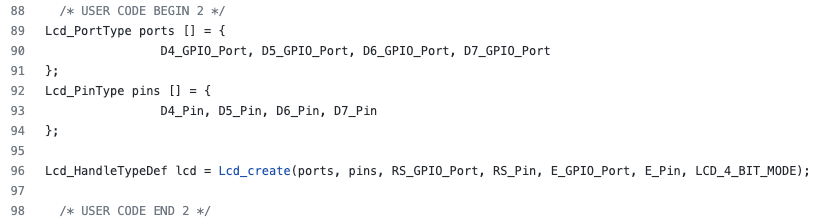
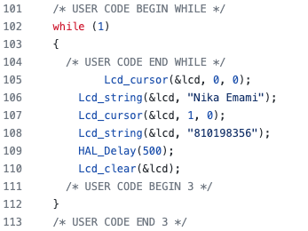
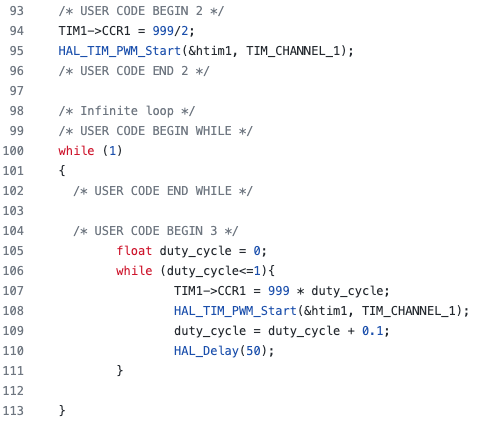
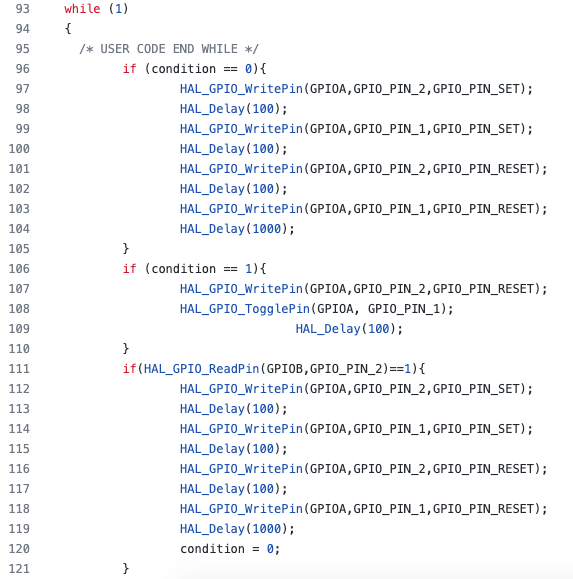
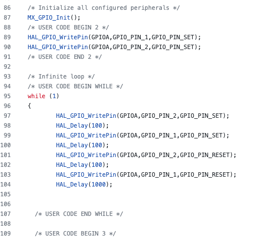
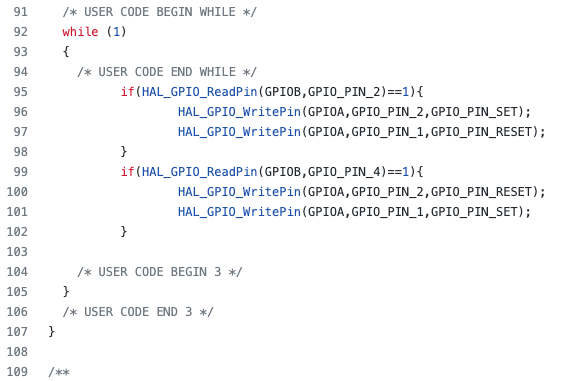

# STM32_Basics
Implementation of basic components like counter, timer, LCD display, external interrupt, PWM,  and digital pins on STM32 micro-controller.

The implementation of different ports and pins for the micro-controller is as follows:

<h3> &nbsp;Counter</h3>

A counter is implemented to count the number of times a push button on a micro controller pin has been pressed. The code corresponding to this component is in the main.c while loop as below:

<h3> &nbsp;Timer</h3>

Connected a timer to our STM32 micro controller that resets after some time to an initial value.  The code corresponding to this component is in the main.c while loop as below:

<h3> &nbsp;LCD Display</h3>

Connected an LCD to the STM32 micro controller, and printed my name and student number in its first two lines. The ports and pins corresponding to the LCD are as follows:

The other important part of the code corresponding to this component is in the main.c while loop as below:

<h3> &nbsp;PWM</h3>

A program to change the duty cycle of the input square wave voltage.

I wrote a program to use STM32 micro-controller and generates a square input voltage with frequency of 2 KHertz. The duty cycle of this voltage changes from 0 to 100 percent (with 10 percent steps) every 20 ms.

The important part of the code corresponding to this component is in the main.c while loop as below:

<h3> &nbsp;External Interrupt</h3>

Two pins are defined on the microcontroller. We have a pushup button and a digital input connected to them. The goal is to have the LED's blink in a certain speed when pushing the buttons.

The important part of the code corresponding to this component is in the main.c while loop as below:

<h3> &nbsp;Digital-Pin</h3>

Two green and red LEDs are connected to digital pins in a STM32 microcontroller. We want to turn them on and off periodically.

The important part of the code corresponding to this component is in the main.c while loop as below:

<h3> &nbsp;Digital-Pin Digital-Input</h3>

Two push buttons with pull up resistors connected to them as their output are connected to a STM32 microcontroller. The goal is to turn the LED's on and off by pushing those buttons.

The important part of the code corresponding to this component is in the main.c while loop as below:

